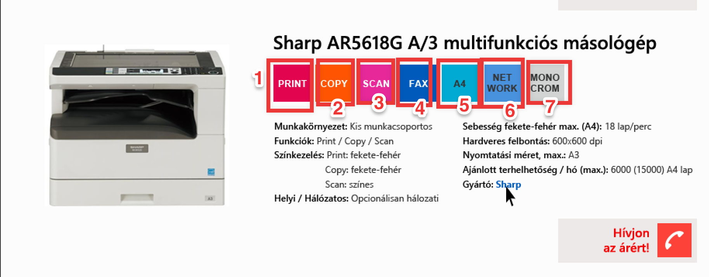

# Nyomtatók attribútumai



1. ```Print```: rendelkezik-e az eszköz nyomtatási funkcióval? (ez azért lett bevezetve mert dedikált szkennereket 
is szerettek valamikor értékesíteni és ez meg is maradt). A ```printers.printing_mode``` tárolja. Lehetséges értékek: 
*NULL* - nem áll rendelkezésünkre infó; *0* - A funkció nem elérhető (nem kell kitenni a négyzetet); 
*1* - A funkció elérhető fehér-fekete módban; *2* - A funkció elérhető színes módban. Létrehoztam ehhez egy 
```App\Helpers\DeviceFunctionality``` osztályt.
2. ```Copy```: rendelkezik-e az eszköz másolási funkcióval? A ```printers.copying_mode``` tárolja. A lehetséges 
értéke megegyeznek a *Print* részben megadott értékekkel. 
3.  ```Scan```: rendelkezik-e az eszköz másolási funkcióval? A ```printers.scaning_mode``` tárolja. A lehetséges 
   értéke megegyeznek a *Print* részben megadott értékekkel. 
4. ```Fax```: a nyomtatóhoz elérhető-e fax funkció. Akkor kell a dobozt megjeleníteni, ha 
a ```printers.fax_availability``` értéke ```\App\Helpers\OptionalDeviceFunctionality::YES_ID``` 
vagy ```\App\Helpers\OptionalDeviceFunctionality::OPTIONAL_ID```.
5. ```A4```: A nyomtatóhoz engedélyezett maximális oldalméret A ```printer_papersize``` táblán keresztül érjük el a ```papersize```
méreteket.
6. ```Network```: a) nyomtató helyi (```\App\Helpers\OptionalDeviceFunctionality::NA_ID```) vagy b) hálozatos funckió alapból
vagy opciónálisan elérhető. A dobozt a b) esetben kell megjeleníteni.
7. ```Monochrom```: ez valójában arra vonatkozik, hogy hogyan nyomtat a nyomtató, fehér-fekete vagy színes. 
```printers.color_technology``` tárolja az értéket. Ha színes, azaz ```printers.color_technology``` értéke 
```App\Helpers\ColorTechnology::COLOR_ID``` akkor a ```COLOR``` felíratnak kell megjelennie a "Négyzet színezés színes nyomtatónál"
résznél megadott módon kell színezni (vagy hasonló módon).  
*FONTOS*: a doboz hátterének grádiens alapú színezését kizárólag ebben (7) pontban kell elvégezni, a többi funkciódoboz 
hátterét a tervben megadott színnel kell elvégezni.
8. (+1) van-e wifije (doboz + wifi icon) ha  a ```printers.wifi_availability``` értéke 
```\App\Helpers\OptionalDeviceFunctionality::YES_ID``` 
vagy ```\App\Helpers\OptionalDeviceFunctionality::OPTIONAL_ID```.


# Megjegyzések

 -  Négyzet színezés színes nyomtatónál 
 ```{css}
div {
  height: 60px;
  width:60px;
  background-color: red;
  background-image:
    radial-gradient(
      #ffff00,
      #f06d06
    );
} ``` 
